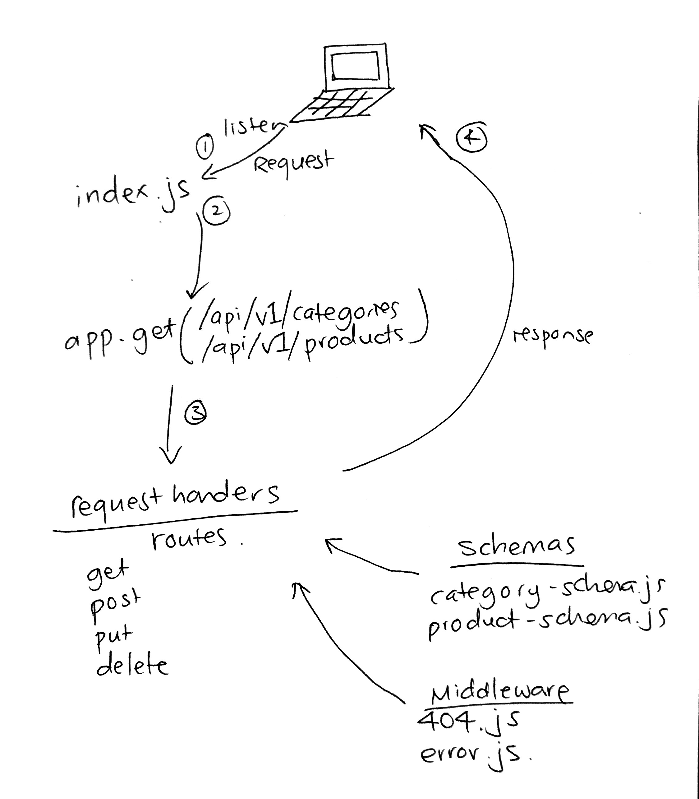

# LAB - 08

## Express Routing and Connected API

### Author: Joanna Arroyo

### Links and Resources
* [submission PR](https://github.com/joanna-401-advanced-javascript/lab-08-express/pull/2)
* [travis](https://travis-ci.com/joanna-401-advanced-javascript/lab-08-express)
* [front-end](https://joanna-lab-08.herokuapp.com/)

#### Documentation
* [api docs](./docs/swagger.json)
* [jsdoc](https://joanna-lab-08.herokuapp.com/docs)

### Modules
#### `category-routes.js`
##### Exported Values and Methods

###### `getCategory(request, response) -> array of JSON objects`
Gets existing categories

###### `postCategories(request, response) -> JSON object`
Creates category and adds to database

###### `putCategory(request, response) -> JSON object`
Modifies existing category

###### `deleteCategories(request, response) -> JSON object`
Deletes existing category

#### `product-routes.js`
##### Exported Values and Methods

###### `getProducts(request, response) -> array of JSON object`
Gets existing products

###### `getProduct(request, response) -> JSON object`
Gets existing product by ID

###### `postProduct(request, response) -> JSON object`
Creates product and adds to database 

###### `putProducts(request, response) -> JSON object`
Modifies existing product

###### `deleteProducts(request, response) -> JSON object`
Deletes existing product

### Setup
#### `.env` requirements
* `PORT` - Port Number
* `MONGODB_URI` - URL to the running mongo instance/db

#### Running the app
* `node index.js`
* Endpoint: `/api/v1/categories`
  * Returns a JSON object with existing categories
* Endpoint: `/api/v1/products`
  * Returns a JSON object with existing products
  
#### Tests
* Unit tests: `npm run test`
* Lint tests: `npm run lint`

#### UML
